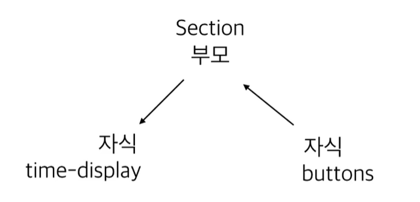
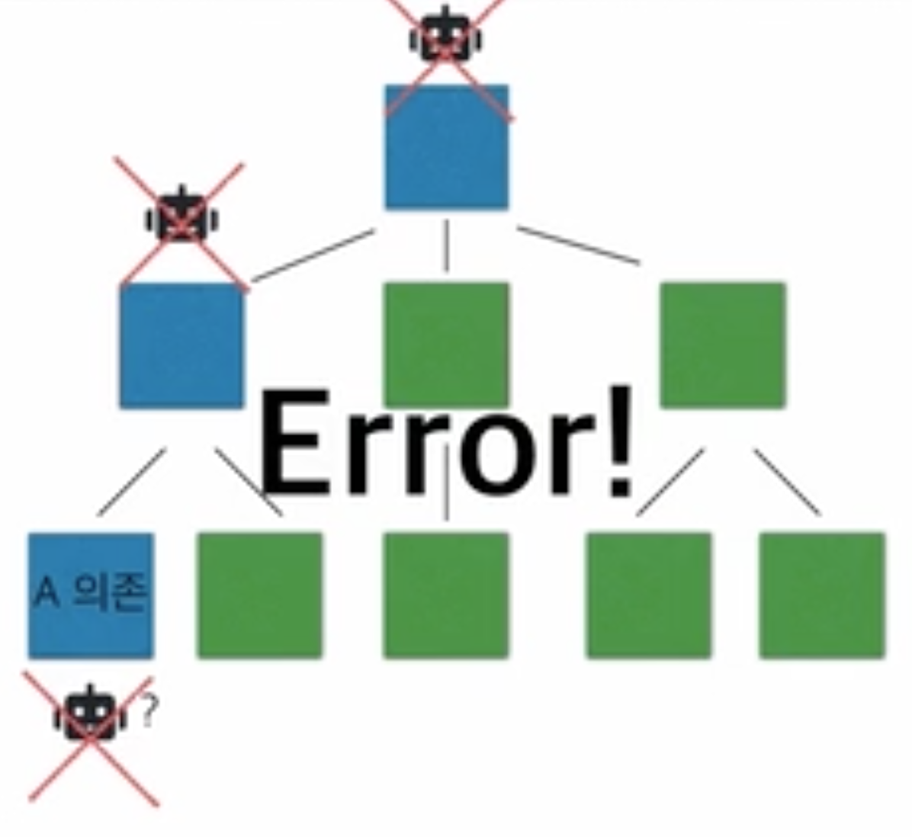
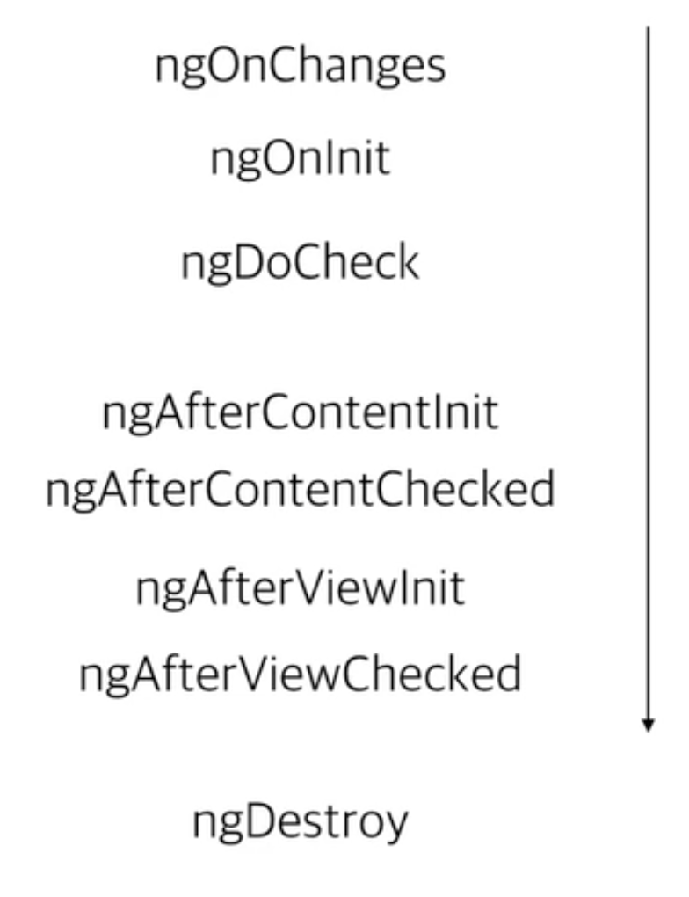

# Angular(2+) Front에서 Back까지 - 앵귤러 기본

*Assembled by GimunLee (2019-12-08)*

<br/>

## 기본용어

- **Directives** : 확장된 HTML로 `custom` 속성과 `elements` 태그 속성을 직접 정의할 수 있습니다.

- **Expresions** : 변수와 함수를 HTML 파일에서 출력해야할 때 사용합니다. (Data Binding)

  ```html
  <p>hello {{name}}!</p>
  ```

- **Module** : `Directives`, `Controller` 이것들을 하나로 모아놓은 `Container` 입니다. (의존성 주입 가능)

- **Controller** : View의 비즈니스 로직을 구현하는데만 사용합니다. 단, 주의할 점이 있는데 `DOM`과 `IO`을 조작하면 안됩니다.
  
- **Service** : `Controller`와 다르게 재사용가능한 비즈니스 로직으로 싱글톤 패턴으로 구현되어있으며, 애플리케이션의 데이터를 관리할 때 사용하면 좋습니다.

<br/>

## 개발환경 구성

1. `node` 설치

2. `Angular-cli` 설치

   ```bash
   $ npm install -g @angular/cli
   ```

3. 설치 확인

   ```bash
   $ ng version
   ```

4. 프로젝트 생성

   ```bash
   $ ng new {프로젝트 명}
   ```

<br/>

## 프로젝트 구조 및 실행

- **index.html** : 사용자가 받는 HTML 파일입니다.

- **main.ts** : 가장 먼저 실행되는 `javascript` 파일입니다.

- **src/app/*** : 구현한 Component, Module 등이 들어가는 중요한 디렉토리입니다.

- **app.module.ts**

  ```typescript
  // AppModule class를 Module로 만들어줌
  @NgModule({
    declarations: [
      AppComponent
    ],
    imports: [ // 다른 Module을 사용
      BrowserModule,
      AppRoutingModule
    ],
    providers: [], // View가 아닌 Service 로직
    bootstrap: [AppComponent] // 처음 실행할 Component 지정
  })
  export class AppModule { }
  ```

- **app.componet.ts**

  ```typescript
  @Component({ // 하나의 레고 조각
    selector: 'app-root', // 태그 네임 <app-root></app-root>
    templateUrl: './app.component.html', // HTML 파일의 경로
    styleUrls: ['./app.component.scss'] // CSS 파일의 경로
  })
  export class AppComponent {
    title = 'front-end';
  }
  ```

- **파일 호출 순서**
  
  `index.html` → `main.ts` → `app.module.ts` → `app.component.ts`

- **실행**

  ```bash
  $ ng serve
  ```

  - *Cannot find angular/module Error* 발생 시,

    ```bash
    $ npm -i @angular-devkit/build-angular
    ```

<br/>

## Component 만들기

`angular-cli` 컴포넌트 생성 명령어

```bash
$ ng g c {컴포넌트 명} # ng generate component {컴포넌트 명}
```

**hello.component.ts**

```typescript
import { Component } from '@angular/core';

@Component({
    selector : 'hello',
    template : './hello.component.html',
    styleUrls : ['./hello.component.css']

})
export class HelloComponet {
    
}
```

**hello.component.html**

```html
<div>
    안녕하세요! hello 컴포넌트입니다.
</div>
```

**hello.component.css**

`component.ts` 파일 안에서 `styleUrls`에 포함시키지 않는 이상, Component 간 서로 공유할 수 없습니다. 

- 다른 css 파일 적용하기

  ```typescript
  // {컴포넌트명}.component.ts
  @Component({
    selector: 'app-header',
    templateUrl: './header.component.html',
    styleUrls: ['./header.component.scss'] // 원하는 scss 파일 추가시, style 적용 가능
  })
  ```

<br/>

## Angular를 이해하기 위한 타입스크립트 지식

### 기초

- typescript 시작

  ```bash
  $ tcs -init
  ```

- typescript에서 타입 지정

  ```typescript
  let num : number = 10;
  
  num.push(); // Error! -> 'number'로 지정했기 때문에!
  
  function testing() : string {
      return 10; // Error! -> return type이 'string'이기 때문에!
  }
  ```

- typescript class

  ```typescript
  class AppComponent { 
  
  }	
  ```

- javascript (ES6) class

  ```javascript
  var AppComponent = (function(){
  	function AppComponent(){
  	
  	}
  	return AppComponent;
  }());
  ```

  - 브라우저가 ES6를 읽지 못한다해도 typescript 빌드 파일 `tsconfig.json`에서 버전만 바꿔주면 알아서 컴파일 해줍니다.

### typescript class 기능

기본적으로 ES6의 class보다 typesript의 class가 더 많은 기능을 갖고 있습니다.

- 상속 

  ```typescript
  class Parent {
      
  }
  
  class App extends Parent{
  	
  }
  ```

- 인터페이스

  ```typescript
  interface Person {
  	name: string
  	age: number
  }
  
  let kim: Person
  ```

- 접근제한자 (ES6에는 없음)

  ```typescript
  class Parent { 
  	public one = 10;
  	protected two = 10;
  	private three = 10;
  }
  
  class Child extends Parent {
    constructor() {
      super();
      this.one
      this.two
    }
  }
  
  let p = new Parent();
  p.one // one만 접근 가능!
  ```

- 생성자

  ```typescript
  class Car {
    // javascript(ES6) 불가능
   	constructor(public age: number) {
  	}
      
    /* 위와 같은 표현으로 typescript의 독특한 문법
    * age
    * constructor(age:number){
    *  this.age = age; 
    * }
    */
  }
  
  let car = new Car(10);
  ```

  - `public` 을 붙이면 자동으로 Car의 멤버변수가 됩니다.

<br/>

## 바인딩 (Binding)

### 데이터 바인딩

- **time-display.component.ts**

  ```typescript
  export class TimeDisplayComponent implements OnInit {
    test = 1;
    constructor() { 
      setInterval(()=>{ // 1초마다 test 값 증가
        this.test++;
        }, 1000
      )
    }
    ngOnInit() { // 생명주기와 관련있으며, 추후 설명 예정
    }
  }
  ```

- **time-display.component.html**

  ```html
  <p>
      {{test}} <!-- 데이터바인딩(단반향) : typescript -> HTML -->
  </p>
  ```

### 이벤트 바인딩

- **buttons.component.html**

  ```html
  <button class="start-btn" (click)='test($event)' >
      시작
  </button>
  ```

- **buttons.component.ts**

  ```typescript
  test($event:MouseEvent){
    // 마우스 클릭 이벤트 발생 시, 로직 작성
  }
  ```

### 부모와 자식 간의 바인딩

Angular에서는 이벤트로 데이터를 받으려면 $event 로 받을 수 있습니다. 



자식(buttons)에서 클릭 시, 부모(Section)을 통해 자식(time-display)로 바인딩을 해보겠습니다.

#### 1. Buttions (자식)

- **buttons.component.html**

  ```html
  <p>
      <button class="start-btn" (click)="executeButton('start')"> 
          start
      </button>
  
      <button class="stop-btn" (click)="executeButton('stop')">
          stop
      </button>
  
      <button class="reset-btn" (click)="executeButton('reset')">
          reset
      </button>
  </p>
  ```

- **buttos.component.ts**

  ```typescript
  @Output() clickEvent = new EventEmitter();
  
  executeButton(command) {
      this.clickEvent.emit(command);
  }
  ```

  - `@Output` : 부모로 데이터 전달

#### 2. Section (부모)

- **section.compontent.html**

  ```html
  <div class="title">
      <div class="display">
          <app-time-display [inputData]="present" ></app-time-display>
          <app-buttons (clickEvent)="startTime($event)"></app-buttons>
      </div>
  </div>
  ```

  - `[inputData]` :   time-display의 `@Input()` 과 바인딩

- **section.compontent.ts**

  ```typescript
  present = 'welcome';
  
  startTime($event){
  	this.present = $event;
  }
  ```

### 3. time-display (자식)

- **time-display.component.html**

  ```html
  <div>
      <div class="time-text">
          <span> {{min}} : {{sec}} </span> <small>. {{ms}} </small>
      </div>
  </div>
  ```

- **time-display.component.ts**

  ```typescript
  @Input() inputData:string;
  
  min:number = 0; 
  sec:number = 0;
  ms:number = 0;
  
  timeInterval;
  
  timeStart(){
      this.timeInterval = setInterval(()=>{
          this.ms++;
      },10)
  }
  
  timeStop(){
      clearInterval(this.timeInterval)
  }
  
  timeReset(){
      this.timeStop();
      this.ms=0;
  }
  
  ngOnChanges(changes:SimpleChanges){ // 변화를 감지하는 함수
      console.log(changes)
      for(let propName in changes){
          if(propName == 'inputData'){
              switch (changes[propName].currentValue){
                  case 'start':
                      this.timeStart();
                      break;
                  case 'stop':
                      this.timeStop();
                      break;
                  case 'reset':
                      this.timeReset()
                      break;
              }
          }
      }
  }
  ```

<br/>

## javascript(ES6) 모듈

기존 자바스크립트의 단점은 `var` 키워드를 사용하지 않으면, 전역 객체의 Property로 설정된다는 단점이 있었습니다. 이런 것을 해결하기 위해 많은 것들이 나왔습니다.또한, 자바스크립트는 기존에 캡슐화를 지원하지 않는 언어였습니다. 이걸 지원하기 위해 모듈 패턴을 사용해서 개선한 대표적인 커뮤니티 `COMMON JS`, `AMD` 두개가 있었습니다.

 `AMD`는 `COMMON JS`의 일부였으나, 두 커뮤니티의 차이점은 `COMMON JS` 는 브라우저 밖에서도 활용할 수 있는 모듈화를 지향했지만, `AMD`는 브라우저 상에서의 모듈화를 지향했습니다. 결국 서로 의견을 좁히지 못했고, `COMMON JS` 는 서버사이드에서 좀 더 유리하게 모듈화되어갔고, `AMD` 는 브라우저 상에서 좀 더 유리하게 모듈화되어갔습니다. 이후, ES6부터는 언어 자체에서 캡슐화나 다른 기능들(export/import, class 등)을 지원하게 되었습니다.

또한, 자바스크립트의 인기로 모듈이 엄청 많아짐에 따라 서로 간의 의존이 복잡해지면서 하나하나 관리하기 힘들어졌습니다. 그래서 나오게 된 것이 Webpack과 같은 Bundler, 모듈 빌더가 나오게 되었습니다. 참고로 Angular-CLI는 Webpack을 사용합니다.

<br/>

## Angular 모듈의 이해

Angular의 모듈 시스템은 자바스크립의 모듈 시스템보다 좀더 발전한 형태입니다. 컴포넌트를 사용하기 위해서는 모듈에 무조건 속해있어서 사용가능하며, 하나의 컴포넌트를 2개의 모듈에 등록할 수 없습니다. 

1. `angualr-cli` 모듈 생성 명령어

   ```bash
   $ ng g m {모듈 명}
   ```

- Declarations의 이해

  `declarations`에서 컴포넌트를 아래와 같이 주석 처리 한다면,

  ```typescript
  @NgModul({
  	declarations : [
  		// TestComponent
  	],
    exports : [
      TestComponent
    ],
  	...
  })
  ```

  컴파일 후 자바스크립트에서 아래와 같은 상태입니다.

  ```javascript
  export // class TestComponent {
  // }
  ```

Angular에서는 refactoring은 모듈과 컴포넌트를 어떻게 구성하느냐에 따라 코드의 품질이 많이 달라집니다.

<br/>

## 라우팅 (Routing)

```typescript
const routes: Routes = [
  {
    path : '123',
    redirectTo:'index',
    pathMatch:'full'
  },
  {
    path:'index',
    component: AppComponent
  }
];
```

Angular에서 `redirect`시, 필수적으로 요구되는 것이 있는데 pathMatch 방식입니다.

1. pathMatch:`'full'` :  http://domain.com/123 (정확히 일치해야함)
2. pathMatch:`'prefix'` : http://domain.com/123*** (주어진 부분만 일치하고 뒤에는 상관없음)

router-outlet을 이용하면, path 값에 맞는 컴포넌트를 불러옵니다.

```html
<router-outlet></router-outlet> <!-- path 값에 맞는 컴포넌트를 불러옴 -->
```

clock 앞에 / 가 없으면 기존 URL 뒤에 clock이 붙게 됩니다.

```html
<a [routerLink] = "'/clock'">시계로이동</a> 
```

### 라우팅 모듈

아래와 같이 메소드로 바인딩이 가능합니다. 단, 컴포넌트가 변화할 때마다 바인딩된 함수가 전부 불려지기 때문에 비효율적입니다.

```html
{{ getCurrentTime() }}
```

rxjs 문법을 사용해서 해결할 수 있습니다.

```typescript
constructor() { 
  interval(1000)
    .pipe(map(() => { return moment().format('YYYY-MM-DD HH:mm:ss')}))
    .subscribe(data=>{ this.timeString=data;})
}
```

라우터간 데이터 교환은 어떻게 할까요? 이때 서비스가 필요합니다. 서비스의 역할은

- 비슷한 기능(관심사)를 묶어 코드의 중복을 제거하여 재사용 가능한 코드 뭉치로 만들기
- 컴포넌트 간 데이터의 중개 (단, localStorage를 통해 가능은 함)

`angular-cli` 서비스 생성

```bash
$ ng g s {서비스 명}
```

<br/>

## 인젝터 (Injector)

인젝터란, 의존성 주입을 해주는 Angular의 요소이며 `DI(Dependency Injection)` 라고 말합니다. 의존성을 주입할 때, 서비스들을 어떤 곳에 어떤 값으로 배치할까를 결정해주는 것이 `Provider`의 역할입니다. 

`Provider` 지정 3가지

1. **모듈 계층** 에서 `Provider` 제공 : 같은 모듈에서 찾고, 없으면 그 위로 올라가 모듈에서 찾습니다. 
2. **컴포넌트 계층** 에서 `Provider` 제공 : 부모 자식 간에만 찾고, 싱글톤으로 갖고 있습니다. 이때, 가장 먼저 만난 것으로 의존성을 주입 받습니다. 만약 존재하지 않다면, 에러가 발생합니다. 




3. **서비스 계층** 에서 `Provider` 제공

   ```typescript
   @injectable({
   	providedIn:StopwatchComponent
   })
   ```

### Injector 검색 순서

자신의 컴포넌트

→ 부모 컴포넌트

→ 루트 컴포넌트까지 계속 부모-자식 관계를 타고 올라감

→ 루트 모듈

→ 하위 모듈

→ 자신이 속한 모듈까지 내려옴

→ 도중에 해당 서비스에 대한 Provider 값이 있다면 검색 종료

<br/>

## Angular 생명주기



**ngOnchanges**

컴포넌트 구현에 따라 초기에 선택적으로 호출되는 생명 주기입니다.

**ngOnInit**

실질적으로 컴포넌트가 초기화를 마치고 완전한 상태를 갖춘 시점입니다. constructor는 ES6 클래스 문법 표준으로서 Angular가 초기화 작업을 수행하기 전이므로 컴포넌트의 속성 가운데 템플릿과 바인딩한 속성이나 부모 컴포넌트로 받은 속성 등의 초기화를 보장하지 않습니다. API 호출이나 Angular가 제공하는 기능은 **ngOnInit** 이후에 사용해야합니다.

**ngOnDestroy**

컴포넌트가 뷰에서 제거되기 직전 호출됩니다.

**ngAfterContentInit**

컴포넌트의 뷰가 초기화되는 시점에 호출되며, Content Projection으로 전달받은 템플릿의 초기화 완료 시점에 호출 됩니다.

**ngAfterViewInit**

컴포넌트의 템플릿이 완전히 초기화된 시점에 호출됩니다. 이 시점에는 컴포넌트의 모든 속성이 정상적으로 바인딩되었고 뷰도 렌더링 되었음을 의미합니다. 예를 들어 부모 컴포넌트로부터 Property 바인딩으로 받은 속성 a를 템플릿에서 뷰로 노출하도록 구현했을때, ngAfterViewInit이 호출 될 때 a 속성은 부모 컴포넌트로부터 전달됐음을 보장하고 렌더링 됐다는 것도 보장합니다.

**ngOnChanges**

어떠한 이벤트에 의해서 컴포넌트의 상태가 변경된다면 Angular는 ngOnChanges나 ngDoCheck를 호출합니다. 구현한다고 반드시 호출되는 것은 아닙니다. Property 바인딩을 통해 부모 컴포넌트에게 상태를 전달받은 경우에만 호출되는 메서드입니다. SimpleChanges라는 인자와 함께 전달됩니다. SimpleChange 안에는 previousValue와 currentValue라는 속성과 isFirstChange라는 메서드로 이루어진 타입이 존재합니다. 최초 호출 시, isFirstChange는 true, previousValue는 UNINITIALIZED, currentValue는 최초 바인딩 값이 들어있습니다.

**ngDoCheck**

ngDoCheck는 앵귤러가 컴포넌트의 상태 변경을 감지한 후에 항상 호출됩니다. 기본적으로는 최초 컴포넌트 초기화 후 ngOnInit 이후 바로 호출됩니다. 

이후에는 외부 이벤트에 따라 상태 변경 감지가 내부에서 실행된 후에 항상 호출 되며, Angular가 변경 사항을 직접 관리하기 어려운 경우 구현해야 합니다, 가능하면 DoCheck를 구현하지 않거나 구현하더라도 무거운 작업을 포함시키면 안됩니다. 구현된 컴포넌트와 관계없이 애플리케이션에서 일어나는 모든 비동기 이벤트마다 호출되기 때문에 성능에 무리를 줄 수 있습니다.

**ngAfterContentChecked, ngAfterViewChecked**

ngAfterContentInit, ngAfterViewChecked 이후 바로 호출 되는 메서드입니다. 뷰의 상태가 변경된 이후 처리할게 있을 때 사용합니다.

<br/>

## Reference & Additional Resources

https://github.com/cicada0014/angular-lecture
