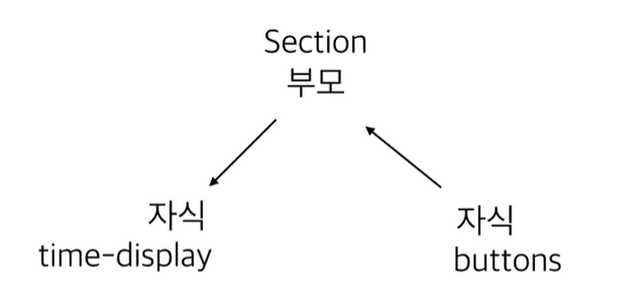

# Angular(2+) Front에서 Back까지 - 앵귤러 기본

*Assembled by GimunLee (2019-12-08)*

<br/>

## 기본 용어

- Directives : 확장된 HTML로 custom 속성과 elements 태그 속성도 직접 정의할 수 있습니다.

- Expresions : 변수와 함수를 HTML 파일에서 출력해야할 때 사용합니다.

  ```html
  <p>hello {{name}}!</p>
  ```

- Module : Directives, Controller 이것들을 하나로 모아놓은 Container를 Module 이라고 합니다. (의존성 주입 가능)

- Controller : 비즈니스 로직을 구현하는데만 사용합니다. View에 비즈니스 로직을 다룰때만 사용해야함
  - 주의할 점
    - DOM을 조작하면 안됨
    - input, output을 조작하면 안됨

- Service : Controller와 다르게 재사용가능한 비즈니스 로직 (싱글톤으로 구현돼있다.) 어플리케이션의 데이터를 관리할 때 사용하면 좋다.

<br/>

## 개발 환경 구성

1. node 설치

2. Angular-cli 설치

   ```bash
   npm install -g @angular/cli
   ```

3. 설치 확인

   ```bash
   ng version
   ```

4. 프로젝트 생성

   ```bash
   ng new {프로젝트명}
   ```

<br/>

## 프로젝트 구조

- index.html : 사용자가 받는 파일 

- main.ts : 가장 먼저 실행되는 javascript 파일

- src/app/* : 가장 신경 써야하는 부분

- (app.module.ts) AppModule class를 module로 만들어주겠다라는 뜻!

  ```typescript
  @NgModule({
    declarations: [
      AppComponent
    ],
    imports: [ // 다른 모듈들이 들어옴
      BrowserModule,
      AppRoutingModule
    ],
    providers: [], // view가 아닌 service 로직
    bootstrap: [AppComponent] // 처음 실행할 컴포넌트 지정
  })
  export class AppModule { }
  ```

- app.componet.ts

  ```typescript
  @Component({ // 하나의 레고 조각
    selector: 'app-root', // 태그 네임
    templateUrl: './app.component.html', // 어떤 html 파일을 가지고 있는지
    styleUrls: ['./app.component.scss'] // css 값들이 들어감
  })
  export class AppComponent {
    title = 'front-end';
  }
  ```

- 파일 불리는 순서
  
  1. index.html - > main.ts -> app.module.ts -> app.component.ts

<br/>

## 실행하기

1. 에러 발생할 수 있음 (Cannot find angular/module)

   ```bash
   npm -i @angular-devkit/build-angular
   ```

2. 실행

   ```bash
   ng serve
   ```

<br/>

## Component 만들기

1. hello.component.ts

   ```
   import { Component } from '@angular/core';
   
   @Component({
       selector : 'hello',
       template : './hello.component.html',
       styleUrls : ['./hello.component.css']
   
   })
   export class HelloComponet {
       
   
   }
   ```

2. hello.component.html

   ```
   <div>
       안녕하세요!
   </div>
   ```

3. hello.component.css

<br/>

## Angular를 이해하기 위한 타입스크립트 지식

1. typescript 시작

   ```bash
   tcs -init
   ```

2. typescript에서 타입 지정

   ```typescript
   let num : number = 10;
   
   num.push(); // Error! -> 'number'로 지정했기 때문에!
   
   function testing() : string {
       return 10; // Error! -> 반환이 'string'이기 때문에!
   }
   ```

3. typescript class 가 javascript에서 

   ```typescript
   class AppComponent { 
   
   }	
   ```

4. javascript (ES 6)

   ```javascript
   var AppComponent = (function(){
   	function AppComponent(){
   	
   	}
   	return AppComponent;
   }());
   ```

   - ㅇ브라우저가 ES 6를 읽지 못한다해도 Typescript에서 tsconfig.json에서 버전만 바꿔주면 알아서 맞춰서 컴파일 해준다.


<br/>

기본적으로 ES6 보다 typesript의 class가 더 많은 기능을 갖고 있습니다.


5. 상속 기능

```javascript
class Parent {
    
}

class App extends Parent{
	
}
```

6. 인터페이스

```javascript
interface Person {
	name: string
	age: number
}

let kim: Person
```

7. 접근제한자 (ES6 에는 없다.)

```javascript
class Parent { 
	public one = 10;
	protected two = 10;
	private three = 10;
}

class Child extends Parent {
    constructor() {
        super();
        this.one
        this.two
    }
}

let p = new Parent();
p.one // one만 접근 가능!
```

8. 생성자

```javascript
class Car {
    //-- typescript만 가능
	constructor(public age: number) {
	}
    
    //-- 위와 같은 표현
    age
    constructor(age:number){
       this.age = age; 
    }
}

let car = new Car(10);
```

public을 붙이면 자동으로 Car의 멤버변수로 된다.

---

component 만드는 command

```bash
ng generate component {컴포넌트명}
ng g c {컴포넌트명}
```

다른 scss 파일 적용하기

```typescript
// {컴포넌트명}.component.ts

@Component({
  selector: 'app-header',
  templateUrl: './header.component.html',
  styleUrls: ['./header.component.scss'] // 원하는 scss 파일 추가시, style 적용 가능
})
```


#### 데이터 바인딩

time-display.component.ts

```typescript
export class TimeDisplayComponent implements OnInit {

  test = 1;

  constructor() { 
    setInterval(()=>{ // 1초마다 test 값 증가
      this.test++;
      }, 1000
    )
  }
  
  ngOnInit() { // 생명주기와 관련있으며, 추후 설명 예정
  }
}
```

time-display.component.html

```html
<p>
    {{test}} <!-- 데이터바인딩(단반향) ts -> html -->
</p>
```


### 이벤트 바인딩

buttons.component.html

```html
<button class="start-btn" (click)='test($event)' >
    시작
</button>
```

buttons.component.ts

```typescript
test($event:MouseEvent){
}
```


### 부모와 자식 간의 데이터 바인딩

앵귤러에선 event로 데이터를 받으려면 $event 로 받을 수 있다.

제네릭을 쓰게 되면 명시적으로 사용하도록 에러를 발생시킨다. (사용하지 않아도 됨)



### 1. buttons

buttos.component.html

```html
<p>
    <button class="start-btn" (click)="executeButton('start')"> 
        start
    </button>

    <button class="stop-btn" (click)="executeButton('stop')">
        stop
    </button>

    <button class="reset-btn" (click)="executeButton('reset')">
        reset
    </button>
</p>
```

buttos.component.ts

```typescript
@Output() clickEvent = new EventEmitter();

executeButton(command) {
    this.clickEvent.emit(command);
}
```

### 2. Section

section.compontent.html

```html
<div class="title">
    <div class="display">
        <app-time-display [inputData]="present" ></app-time-display>
        <app-buttons (clickEvent)="startTime($event)"></app-buttons>
    </div>
</div>
```

- [inputData] :   time-display의 @Input()과 바인딩

section.compontent.ts

```typescript
present = 'welcome';

startTime($event){
	this.present = $event;
}
```

### 3. time-display

time-display.component.html

```html
<div>
    <div class="time-text">
        <span>
            {{min}} : {{sec}}
        </span>
        <small>
            . {{ms}}
        </small>
    </div>
</div>
```

time-display.component.ts

```typescript
@Input() inputData:string;

min:number = 0; 
sec:number = 0;
ms:number = 0;

timeInterval;

timeStart(){
    this.timeInterval = setInterval(()=>{
        this.ms++;
    },10)
}

timeStop(){
    clearInterval(this.timeInterval)
}

timeReset(){
    this.timeStop();
    this.ms=0;

}

ngOnChanges(changes:SimpleChanges){ // 변화를 감지하는 함수
    console.log(changes)
    for(let propName in changes){
        if(propName == 'inputData'){
            switch (changes[propName].currentValue){
                case 'start':
                    this.timeStart();
                    break;
                case 'stop':
                    this.timeStop();
                    break;
                case 'reset':
                    this.timeReset()
                    break;
            }
        }
    }
}
```

<br/>

## 자바스크립트(ES6)의 모듈에 대해서

기존 javascript의 단점은 var 키워드를 사용하지 않으면, 전역 객체의 프로퍼티로 설정된다는 단점이 있었습니다. 이런 것들을 해결하기 위해, 많은 것들이 나왔습니다.


자바스크립트는 기존에 캡슐화를 지원하지 않는 언어였습니다. 이걸 지원하기 위해 모듈 패턴을 사용했습니다. 

대표적으로

COMMON JS

AMD

가 있었습니다. 차이점은 

COMMON JS는 브라우저 밖에서도 활용할 수 있는 모듈화를 지향했습니다. AMD는 브라우저 사엥서의 모듈화를 지향했습니다. 결국 AMD는 COMMON JS의 일부였으나, 서로 의견을 좁히지 못했습니다.

COMMON JS는 서버사이드에서 좀더 유리하게 모듈화

AMD는 브라우저 상에서 좀더 유리하게 모듈화

이후, ES6부터 언어자체에서 지원하게 됨 (export, import가 추가됨)

모듈이 엄청 많아짐에따라 서로 간의 의존이 복잡해짐, 하나하나 관리하기 힘드니까 모듈 빌더, 번들러가 나오게됨 (Webpack)

Angular CLI는 Webpack을 사용한다.


**export default와 export의 차이**

<br/>

## Angular 모듈의 이해

ng g m {모듈이름}

Angular의 모듈시스템은 자바스크립의 모듈시스템보다 좀더 발전한 형태입니다.

*모듈과 컴포넌트의 관계는 뭘까?*

Declarations : 

하나의 컴포넌트를 2개의 모듈에 등록할 수 없습니다. 컴포넌트를 사용하기 위해서는 모듈에 무조건 속해있어서 사용가능합니다.

```typescript
@NgModul({
	declarations : [
		// TestComponent
	],
  exports : [
    TestComponent
  ],
	...
})
```

위의 소스는 자바스크립트에서 아래와 같은 상태입니다.

```javascript
export // class TestComponent {
// }
```


**앵귤러 리팩토링**

모듈과 컴포넌트를 어떻게 속하게 하느냐에 따라 많이 달라짐 (코드의 품질)


<br/>

## 라우팅

```typescript
const routes: Routes = [
  {
    path : '123',
    redirectTo:'index',
    pathMatch:'full'
  },
  {
    path:'index',
    component: AppComponent
  }
];
```

- redirect시, 필수적으로 요구되는 것이 있는데, 

  1. pathMatch:'full' :  http://domain.com/123 정확히 일치
  2. pathMatch:'prefix' : http://domain.com/123***

- ```html
  <router-outlet></router-outlet> <!-- path 값에 맞는 컴포넌트를 불러옴 -->
  ```

  <a [routerLink] = "'/clock'">시계로이동</a> 

  clock에 / 가없으면 기존 뒤에 clock이 붙게된다.

### 라우팅 모듈에 대해서


{{getCurrentTime()}} : 메소드로 바인딩 가능, 컴포넌트가 변화할떄마다 바인딩된 함수가 전부 불려짐 -> 비효율적

Rxjs 문법 사용해서 해결

```typescript
constructor() { 
    interval(1000)
      .pipe(map(() => {
        return moment().format('YYYY-MM-DD HH:mm:ss')
      }))
      .subscribe(data=>{
        this.timeString=data;
      })
  }
```

라우터간 데이터 교환은 어떻게 할까? 이때 서비스가 필요함

서비스의 역할은

- 비슷한 기능(관심사)를 묶어 코드의 중복 제거 (재사용 가능한 코드 뭉치로 만들 수 있음)
- 컴포넌트 간 데이터의 중개 (localStorage를 통해 가능하기는 함)


ng g s {서비스이름}


## 인젝터에 대해서

의존성 주입을 해주는 앵귤러의 요소

DI (Dependency Injection) : 


서비스들을 어떤 곳에 어떤 값으로 배치할까를 결정해주는 것이 provider

프로바이더 지정 3가지

1. 모듈계층에서 프로바이더 제공 (같은 모듈에서 찾음, 없으면 그 위로 올라간 모듈에서 찾는다.)
2. 컴포넌트 계층에서 프로바이더 제공 : 부모자식간에만 찾게된다. // 싱글톤으로 갖고 있게 됩니다. // 가장 먼저 만난것에서 의존성을 주입 받음


3. 서비스 계층에서 프로바이더 제공

```
@injectable({
	providedIn:StopwatchComponent
})
```


## Injector 검색 순서

자신의 컴포넌트

-> 부모 컴포넌트

-> 루트 컴포넌트까지 계속 부모-자식 관계를 타고 올라감

-> 루트 모듈

-> 하위 모듈

-> 자신이 속한 모듈까지 내려옴

-> 도중에 해당 서비스에 대한 프로바이더스 값이 있다면 검색 종료


## 생명주기


#### ngOnchanges

컴포넌트 구현에 따라 초기에 선택적으로 호출되는 생명 주기

#### ngOnInit

실질적으로 컴포넌트가 초기화를 마치고 완전한 상태를 갖춘 시점 constructor는 ES6 클래스 문법 표준으로서 앵귤러가 초기화 작업을 수행하기 전이므로 컴포넌트의 속성 가운데 템플릿과 바인딩한 속성이나 부모 컴포넌트로 받은 속성 등의 초기화를 보장하지 않음

=> API 호출이나 앵귤러가 제공하는 기능은 ngOnInit 이후에 사용해라

#### ngOnDestroy

컴포넌트가 뷰에서 제거되기 직전 호출

#### ngAfterContentInit

컴포넌트의 뷰가 초기화되는 시점에 호출, Content Projection으로 전달받은 템플릿의 초기화 완료 시점에 호출 됨

#### ngAfterViewInit

컴포넌트의 템플릿이 완전히 초기화된 시점에 호출; 이 시점에는 컴포넌트의 모든 속성이 정상적으로 바인딩되었고 뷰도 렌더링 되었음을 의미. 예를 들어 부모 컴포넌트로부터 프로퍼티 바인딩으로 받은 속성 a를 템플릿에서 뷰로 노출하도록 구현했을때, ngAfterViewInit이 호출 될 때 a 속성은 부모 컴포넌트로부터 전달됐음을 보장하고 렌더링 됐다는 것도 보장.

#### ngOnChanges

어떠한 이벤트에 의해서 컴포넌트의 상태가 변경된다면 앵귤러는 ngOnChanges나 ngDoCheck를 호출; 구현한다고 반드시 호출되는 것은 아님 => 프로퍼티 바인딩을 통해 부모 컴포넌트에게 상태를 전달받은 경우에만 호출되는 메서드. SimpleChanges라는 인자와 함께 전달; SimpleChange 안에는 previousValue와 currentValue라는 속성과 isFirstChange라는 메서드로 이루어진 타입. 최초 호출 시: isFirstChange는 true, previousValue는 UNINITIALIZED, currentValue는 최초 바인딩 값.

#### ngDoCheck

ngDoCheck는 앵귤러가 컴포넌트의 상태 변경을 감지한 후에 항상 호출

기본적으로는 최초 컴포넌트 초기화 후 ngOnInit 이후 바로 호출

이후에는 외부 이벤트에 따라 상태 변경 감지가 내부에서 실행된 후에 항상 호출 됨. 앵귤러가 변경 사항을 직접 관리하기 어려운 경우 구현해야 함, 가능하면 DOCheck를 구현하지 않거나 구현하더라도 무거운 작업을 포함시키면 안됨. 구현된 컴포넌트와 관계없이 애플리케이션에서 일어나는 모든 비동기 이벤트마다 호출되기 때문에 성능에 무리를 줄 수 있음.

#### ngAfterContentChecked, ngAfterViewChecked

ngAfterContentInit, ngAfterViewChecked 이후 바로 호출 되는 메서드, 뷰의 상태가 변경된 이후 처리할게 있을 때 사용

<br/>

## Reference & Additional Resources

https://github.com/cicada0014/angular-lecture